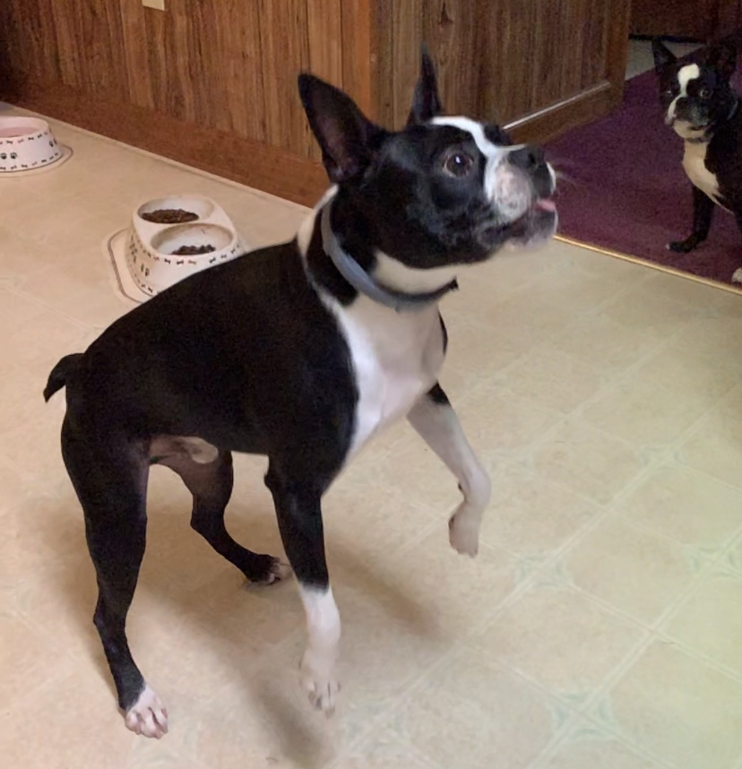
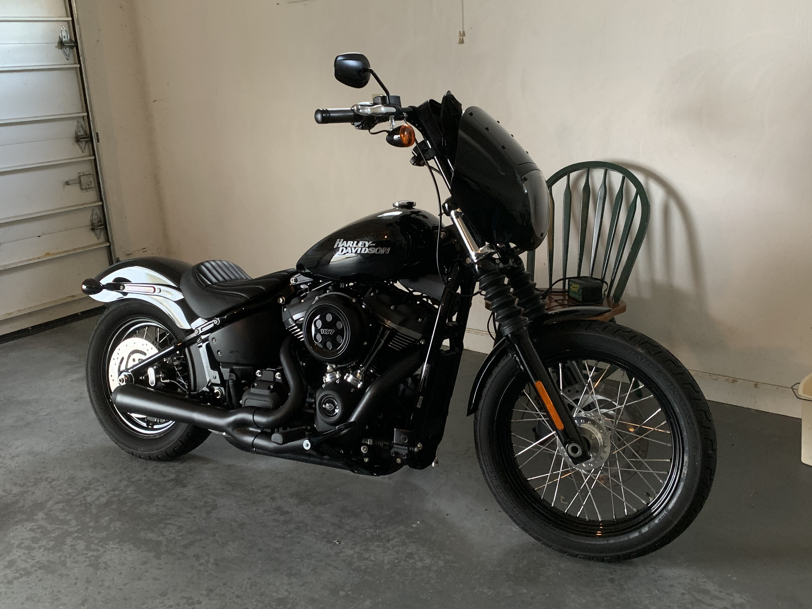

## Tyler's Personal Website

Welcome to what will hopefully be a successfully operating webpage with stuff about me & some of my coding / programming accomplishments in ISAT 252! Stick around and have some cookies while you're here

## Some interesting facts about me...
- I ride a Harley Davidson Street Bob
- I have two Boston Terriers, Oreo & Harley (Yes, we named him after Harley-Davidson)
- Junior ISAT major @ James Madison University
- I am an Eagle Scout Recipient

## Harley (the boy) is front and center, Oreo (the girl) is in the background



## Here's a video of my pride and joy, my Harley.... and before you ask, yes it is FAST!



### Markdown

Markdown is a lightweight and easy-to-use syntax for styling your writing. It includes conventions for

```markdown
Syntax highlighted code block

# Header 1
## Header 2
### Header 3

- Bulleted
- List

1. Numbered
2. List

**Bold** and _Italic_ and `Code` text

[Link](url) and 
```

For more details see [GitHub Flavored Markdown](https://guides.github.com/features/mastering-markdown/).

### Jekyll Themes

Your Pages site will use the layout and styles from the Jekyll theme you have selected in your [repository settings](https://github.com/astontk/astontk.github.io/settings). The name of this theme is saved in the Jekyll `_config.yml` configuration file.

### Support or Contact

Having trouble with Pages? Check out our [documentation](https://docs.github.com/categories/github-pages-basics/) or [contact support](https://github.com/contact) and we’ll help you sort it out.
