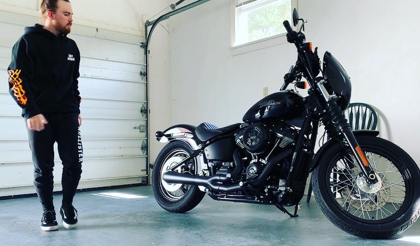

## Welcome to Tyler's Personal Website

Welcome to what will hopefully be a successfully operating webpage with stuff about me & some of my coding / programming accomplishments in ISAT 252! Stick around and have some cookies while you're here

## Some interesting facts about me...
- I ride a Harley Davidson Street Bob
- I have two Boston Terriers, Oreo & Harley (Yes, we named him after Harley-Davidson)
- Junior ISAT major @ James Madison University
- I am an Eagle Scout Recipient

## Harley (the boy) is front and center, Oreo (the girl) is in the background

## Here's some pictures of my pride and joy, my Harley.... and before you ask, yes it is FAST!

## Programming Successes!
Here is the link to the github repository of a successful hello world program I made using using JavaScript

https://github.com/astontk/hello-world-javascript2
